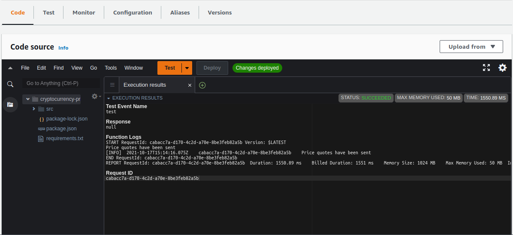
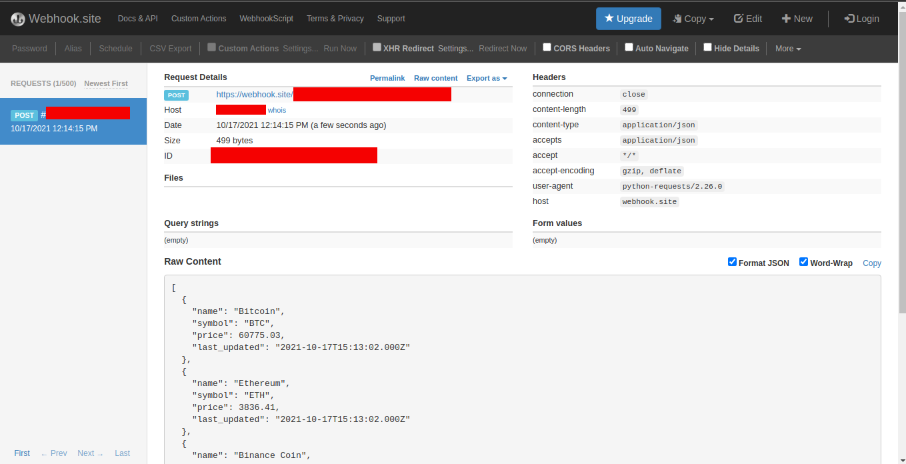

# Cryptocurrency Prices

[](https://www.python.org)

* [Overview](#overview)
* [Instalação](#installation)
    - [Repositório](#repository)
    - [Configuração](#settings)
* [CI/CD](#cicd)
* [Roadmap](#roadmap)
* [Testes](#tests)

<div id="overview"></div> 

## Overview

A ideia deste projeto é aplicar o conteúdo estudado sobre **AWS Lambda**. Ele implementa uma funcionalidade simples,
consultar a cotação de uma quantidade determinada de criptomoedas, e enviar os dados processados para uma API.

<div id='installation'></div> 

## Instalação

<div id='repository'></div> 

### Repositório

Para clonar o repositório usando a linha de comando, execute:

```bash
> git clone https://github.com/gustavofreze/cryptocurrency-prices.git
```

<div id='settings'></div> 

### Configuração

É necessário configurar as variáveis de ambiente, para todos os ambientes que você for executar. Isso pode ser feito
definindo os respectivos valores em [configs](configs).

A consulta de cotações é feita usando esta [API](https://coinmarketcap.com/api). Crie uma conta para obter uma chave de
autenticação. A chave deve ser colocada na propriedade `PRICE_KEY` do arquivo de configuração.

A notificação é feita usando esse [Webhook](https://webhook.site), basta copiar a url e adicioná-la a
propriedade `NOTIFICATION_URL` do arquivo de configuração.

Para executar a consulta, processamento e envio dos preços, você pode executar em ambiente local, o seguinte comando:

```bash
> make run
```

<div id="cicd"></div> 

## CI/CD

O processo de integração e entrega contínua, definido nessa [pipeline](.github/workflows/pipeline-aws.yml), automatiza o
processo de implantação da lamba em ambientes diferentes.

Para realizar o deploy, será necessário ter uma conta na [AWS](https://aws.amazon.com), e obter as chaves de acesso
no [IAM](https://console.aws.amazon.com/iamv2/home#/home), `Access key ID` e `Secret access key`. Seu usuário precisa de
permissões para o **S3**, **Cloud Watch Logs**, **Cloud Formation** e **Lambda**.

Com as devidas permissões atribuídas, e com suas chaves de acesso, defina no repositório
suas [Actions secrets](https://github.com/gustavofreze/cryptocurrency-prices/settings/secrets/actions), levando em
consideração seu environment.

O action será executado nas operações de push para as branches `main` e `release/**`, onde eu defini que `main` possui o
environment `production`, enquanto `release/**` possui o environment `staging`.

<div id='roadmap'></div> 

## Roadmap

Depois que o processo de CI/CD foi finalizado, e a lambda foi implantada na AWS, basta acessar o
[console](https://sa-east-1.console.aws.amazon.com/lambda/home?region=sa-east-1#/functions/cryptocurrency-prices?tab=code)
e executar a chamada do lambda com um evento de teste.

<!--suppress HtmlDeprecatedAttribute -->
<p align="center">
    
    <br />
    <tl>Resultado da chamada do evento de teste.</tl>
</p>

Após a chamada do evento de teste, verifique os dados enviados para o webhook que você definiu anteriormente.

<!--suppress HtmlDeprecatedAttribute -->
<p align="center">
    
    <br />
    <tl>Dados recebidos pelo webhook.</tl>
</p>

<div id="tests"></div> 

## Testes

###### Executar testes em ambiente local.

- Executa todos os testes:

  ```bash
  > make test
  ```
